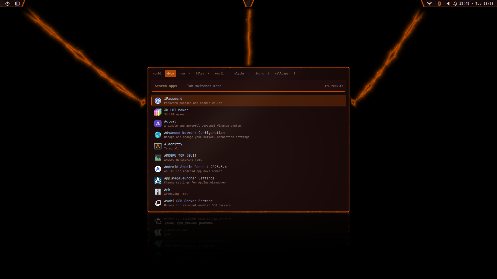

# dotfiles

Personal dotfiles managed with [GNU Stow](https://www.gnu.org/software/stow/manual/stow.html).
Arch (Hyprland) and macOS from one tree.

Every top-level directory is a **stow package** whose contents mirror `$HOME`, and
**every package has its own README** — the table below links them.

```text
dotfiles/
  fish/
    .config/fish/config.fish   →  ~/.config/fish/config.fish
  git/
    .gitconfig                 →  ~/.gitconfig
```



---

## There is a companion private repo

This repo is **published to a public GitHub mirror**. Everything that cannot be
published lives in a second stow repo, `private-dotfiles.git`, hosted on a private
forge and cloned to `~/private-dotfiles`. Same layout, same rules, never published.

| Repo | Holds |
|------|-------|
| `dotfiles` (this one) | every config that is safe to publish |
| `private-dotfiles` | `~/.config/dotfiles/local.env` and `scrub.patterns`; `~/.config/sesh/sesh.toml`; git identity profiles; `~/.ssh/config`; `hypr/lua/monitors.local.lua` |

Neither repo is complete on its own. Some things here **require** the private half
and fail loudly without it:

- `dirs.gitconfig` has no catch-all `includeIf`, so without the private git
  profiles, repos under the work directory get **no identity** and commits fail.
- `tmux` ships only `sesh.example.toml`; the real session list is private.
- `hyprland` `dofile`s `monitors.local.lua`, which carries panel serials.

**Stow `private-dotfiles` first**, then this repo — see that repo's `CLAUDE.md` for
why the order matters.

```sh
git clone <private-forge>/btilford/private-dotfiles.git ~/private-dotfiles
git clone https://github.com/btilford/dotfiles.git ~/dotfiles
```

### Nothing private in this tree

Not just secrets: **host names, LAN IPs and internal project names are
infrastructure disclosure**, and just as permanent once pushed. Anything
machine-specific either resolves from the environment with a public fallback, or
lives in an untracked file.

Three gates enforce it (`mise run lint:private`, lefthook `pre-commit` and
`commit-msg`, and CI) — see [`mise-scripts/`](mise-scripts/README.md) for how they
divide the work and why each prints as little as it does.

⚠️ **Images are not covered by any of them.** `no-local-values.sh` reads text, not
pixels. Look at a screenshot before committing it — see [`docs/`](docs/README.md).

---

## Packages

### Shells and prompt

| Package | What |
|---------|------|
| [`fish`](fish/README.md) | primary interactive shell — and its three load-order traps |
| [`bash`](bash/README.md) | modular `~/.config/bashrc/` drop-ins |
| [`zsh`](zsh/README.md) | same loader shape, plus `~/.zfunc` completions |
| [`nushell`](nushell/README.md) | structured-data shell; four generated files |
| [`starship`](starship/README.md) | cross-shell prompt |
| [`atuin`](atuin/README.md) | shell history, sync, AI — the personal/work seam |

### Editors

| Package | What |
|---------|------|
| [`nvim`](nvim/README.md) | Neovim + lazy.nvim, plus vim/IdeaVim leftovers |
| [`helix`](helix/README.md) | secondary modal editor |
| [`flow`](flow/README.md) | Zig terminal editor, config kept as reference |
| [`dict`](dict/README.md) | harper-ls dictionary (editor-independent) |

### Git and code review

| Package | What |
|---------|------|
| [`git`](git/README.md) | the whole git config — profiles, hooks, credential helpers |
| [`gh`](gh/README.md) / [`glab-cli`](glab-cli/README.md) | forge CLIs; both write untracked auth files |
| [`gh-dash`](gh-dash/README.md) | GitHub PR/issue dashboard (a `gh` extension) |
| [`tuicr`](tuicr/README.md) | review TUI for local diffs and remote PRs/MRs |
| [`hunk`](hunk/README.md) | interactive diff review |
| [`lazygit`](lazygit/README.md) | git TUI |
| [`worktrunk`](worktrunk/README.md) / [`workmux`](workmux/README.md) | worktree managers, sharing one layout |

Stacked branches are managed by **git-spice**. The binary is `git-spice` — never
`gs` in a script or hook, because `/usr/bin/gs` is ghostscript. See `CLAUDE.md`.

### Desktop (Linux / Hyprland)

| Package | What |
|---------|------|
| [`hyprland`](hyprland/README.md) | the compositor config (Lua) |
| [`quickshell`](quickshell/README.md) | the desktop shell — bar, launcher, notifications, session **(screenshots)** |
| [`waybar`](waybar/README.md) | status bar, legacy |
| [`rofi`](rofi/README.md) | launcher, legacy |
| [`wallust`](wallust/README.md) | wallpaper-derived palettes — writes into six other packages |
| [`xdg`](xdg/README.md) | mime handlers and the terminal `xdg-open` uses |
| [`base`](base/README.md) | GTK2/Qt6/XSETTINGS theming, and a yarn supply-chain gate |
| [`kmonad`](kmonad/README.md) | keyboard remapping |
| [`brave-linux`](brave-linux/README.md) | Brave launch flags |

### Terminals and multiplexers

| Package | What |
|---------|------|
| [`ghostty`](ghostty/README.md) | the session terminal |
| [`tmux`](tmux/README.md) | multiplexer, popups, plugins |
| [`wezterm`](wezterm/README.md) | cross-platform fallback |
| [`zellij`](zellij/README.md) | alternate multiplexer |
| [`kitty`](kitty/README.md) | ⚠️ package layout is wrong — see its README |
| [`konsole`](konsole/README.md), [`yakuake`](yakuake/README.md), [`terminator`](terminator/README.md) | KDE/legacy |

### Tools

| Package | What |
|---------|------|
| [`commands`](commands/README.md) | personal scripts on `$PATH`, incl. `dotfiles-local-env` / `dotfiles-secrets` |
| [`metapac`](metapac/README.md) | declarative system packages across hosts |
| [`yazi`](yazi/README.md) | file manager |
| [`visidata`](visidata/README.md) | terminal data explorer |
| [`fastfetch`](fastfetch/README.md) | system info banner |
| [`grype`](grype/README.md) | vulnerability scanner defaults |
| [`bless`](bless/README.md) | hex editor |
| [`envman`](envman/README.md) | envman PATH file |

### Local AI and agents

| Package | What |
|---------|------|
| [`llama-swap`](llama-swap/README.md) | multi-model serving layer (replaced Lemonade) |
| [`ollama`](ollama/README.md) | model server, systemd user unit |
| [`clipborg`](clipborg/README.md) | clipboard manager with LLM actions |
| [`pi-agent`](pi-agent/README.md) | pi agent settings |
| [`docker`](docker/README.md) | MCP gateway |

### macOS

[`macos`](macos/README.md) — AeroSpace, Cocoa keybindings, and a one-shot bootstrap
script that is history rather than an installer.

### Not stow packages

[`mise-scripts/`](mise-scripts/README.md) — task scripts.
[`docs/`](docs/README.md) — images the READMEs embed.
`build/` — gitignored capture scratch.

---

## Usage

Always stow **one package at a time**, always with `--no-folding`.

```sh
stow --no-folding fish        # stow
stow -D fish                  # unstow
stow --no-folding -R fish     # restow, after adding/removing files
stow --no-folding -n -v fish  # dry run
mise run stow                 # interactive picker
mise run status               # classify every package
```

### `--no-folding` does not repair a package that was already folded

Without the flag, stow links a whole **directory** when every file under it belongs
to one package. Passing the flag later changes nothing for a package already
deployed that way — `kmonad`, `fastfetch` and `gh` sat folded for months under a
rule that had supposedly prevented it.

A folded file is a live grenade: **the file at the target is not a symlink, its
parent is.** So it looks like an ordinary file, `diff` against the repo shows no
difference (it *is* the repo's file), and deleting it deletes it **out of the
repo** — which is exactly what happened on 2026-08-12, removing 20 tracked files.

`mise run status` classifies this as **FOLDED**. The repair is
`stow -R --no-folding -t ~ <pkg>` and **never** a deletion.

### Files the repo does not own

A stow package may only contain files this repo writes end to end. Everything else
in a stowed directory gets one of exactly three treatments:

| Tier | For | Mechanism |
|------|-----|-----------|
| **excluded** | the owner writes it; nothing needs a starting point | `.stow-local-ignore` + `.gitignore` |
| **frozen seed** | the owner writes it, but something breaks if it is absent | tracked + stowed + `skip-worktree`, listed in `.stow-frozen` |
| **repo-owned** | we write it, the app merely reads it | ordinary tracked file |

Excluded is the default. `hypr/lua/colors.lua` is the frozen case — `lua/init.lua`
does a bare `require("lua.colors")`, so its absence doesn't mean default colours,
it means Hyprland's config fails to load.

`skip-worktree` lives in `.git/index` and is **not committed**, so it cannot reach
another clone. `.stow-frozen` is the committed half: `mise run setup:frozen`
applies it, `-- --check` audits.

⚠️ A package-local `.stow-local-ignore` **replaces** stow's built-in ignore list
rather than adding to it — which is why the nine packages that have one must name
`README.*` and `CLAUDE.md` explicitly, or those files get symlinked into `$HOME`.

---

## Machine-local config

Machine-specific **values** come from one untracked file:
`~/.config/dotfiles/local.env` (`KEY=VALUE`, no quotes, no expansion, mode 600).

```sh
mise run setup:local-env          # works on a bare checkout, before stowing
$EDITOR ~/.config/dotfiles/local.env
dotfiles-local-env --check        # once `commands` is stowed
dotfiles-local-env --pull         # or render it from Infisical
```

The variable list is `commands/.local/share/dotfiles/required-env`, which records
for each variable whether it is required and which file consumes it — so the audit
cannot drift from what the code actually needs.

Anything **not** launched from a shell — nvim from a desktop entry, systemd user
services, the Wayland session — reads the same file through `environment.d`:

```sh
ln -s ~/.config/dotfiles/local.env ~/.config/environment.d/50-local.conf
```

This is not cosmetic. nvim reads `NEOVIM_API_KEY` via `vim.env`, i.e. the
environment of whatever launched it; without the link it silently becomes the
literal string `missing-NEOVIM_API_KEY`.

Two reserved drop-in slots, ordered **opposite** ways:

- **`05-local-env`** — *values*, must load **early** (configs self-default with
  "set only if unset").
- **`99-local`** — *behaviour* overrides, must load **last** to win. Note this
  holds in bash and zsh but **not in fish**, which loads `conf.d` in byte order.

Secrets are separate: `dotfiles-secrets.service` fetches once at login into
`$XDG_RUNTIME_DIR` (tmpfs, gone at logout) and every shell does a plain local read.
**No shell ever calls the network at startup** — that would hang every new terminal
when the gateway is unreachable.

Git's local seam is `~/.gitconfig.local`, because git has no directory include.

---

## Ignored files — and one that does not work

Stow's **built-in** default ignore list already covers `README.*`, `LICENSE.*`,
`.git`, `.gitignore` and editor backups, which is why most packages need no ignore
file at all.

Nine packages have their own `.stow-local-ignore` (`bless`, `fish`, `gh`,
`ghostty`, `nushell`, `quickshell`, `rofi`, `waybar`, `xdg`). A package-local file
**replaces** the built-in list rather than adding to it, so each of those must name
`README.*` and `CLAUDE.md` explicitly or they get symlinked into `$HOME`.

⚠️ **The `.stow-local-ignore` at the root of this repo is inert.** Stow reads that
file from the *package* directory, never from the parent, so nothing in it applies
to anything. Two entries in it are therefore not doing their job today — verify
before relying on them:

```console
$ stow --no-folding -n -v -t /tmp/probe nvim | grep lazy-lock
LINK: .config/nvim/lazy-lock.json => .../nvim/.config/nvim/lazy-lock.json
```

`nvim/.config/nvim/lazy-lock.json` and `nushell/.config/nushell/history.txt` are
both listed there and both stow anyway. (`nushell` gets away with it — its own
package-local file lists `history.txt` again.) The reserved machine-local names
(`local.env`, `*.local`, `NN-local*`) are in `.gitignore` as well, which is the
half that actually enforces them.

Fixing this means moving the entries into per-package `.stow-local-ignore` files —
and remembering that doing so switches that package to the replace semantics
above.

## Setup on a new machine

```sh
git clone <private-forge>/btilford/private-dotfiles.git ~/private-dotfiles
git clone https://github.com/btilford/dotfiles.git ~/dotfiles
cd ~/dotfiles && mise trust && mise install

mise run setup:local-env                  # local.env, from the manifest
mise run hooks                            # lefthook -> .git/hooks, PER CLONE
mise run setup:frozen                     # skip-worktree bits, PER CLONE
mise run setup:git-template               # generate ~/.local/share/git-template
mise run setup:git-spice                  # forge URL, auth, hook retrofit

# the private half first — one package at a time, as always
for p in dotfiles sesh git hyprland; do
  stow --no-folding -t ~ -d ~/private-dotfiles "$p"
done
# then this repo, one at a time (or use `mise run stow`)
for p in fish nvim tmux git starship; do stow --no-folding "$p"; done

git update-index --skip-worktree \
  hyprland/.config/hypr/wallpaper_effects/.wallpaper_current

# interactive / per-machine, nothing runs these for you
gh auth login
glab auth login --hostname <your-gitlab-host>
gh extension install dlvhdr/gh-dash
atuin hook install claude-code
```

macOS also needs the metapac config bridge — metapac reads
`~/Library/Application Support/metapac/`, ignores `XDG_CONFIG_HOME`, and silently
loads an **empty default** otherwise (every backend disabled, so everything reads
"clean"):

```sh
ln -s ~/.config/metapac ~/"Library/Application Support/metapac"
```

**`mise run hooks` is per clone and nothing runs it for you.** This repo went a
long time without it, so lefthook's formatters and its gitleaks command never
fired on a commit.

---

## Linting and CI

```sh
mise run lint     # shell, secrets, private values, yaml, json, nu, fish, lua
mise run fmt      # shfmt, stylua, taplo, markdownlint
```

Three surfaces run the same class of checks: `mise.toml` (the full suite),
GitHub Actions (runs `mise run lint`, plus `apt install`s fish and lua-check
because those gates **self-skip when their tool is missing**), and GitLab CI (a
deliberate subset in tool-bundled images, because the self-hosted runner cannot
reach `api.github.com` or `sigstore.dev`).

**GitHub is therefore the strictest gate** — a change can pass GitLab and still
fail there. Do not weaken the GitHub workflow to close that gap. When you change
one surface, evaluate the other two.

Pin actions by commit SHA and images by `@sha256:` digest, never by tag: a tag can
be repointed at new code with no commit here.

`.gitleaks.toml` has **no `paths` allowlists and must not gain any** — a path
allowlist matches in every scan mode, so silencing a live untracked config also
blinds a history scan to every secret that path ever held. That is not
hypothetical: it hid five GitLab PATs, a Nexus admin token and a Google app
password. Untracked config is handled at the scan boundary instead
(`lint:secrets` scans `git archive HEAD`, so it never sees untracked files).

---

## Screenshots

The desktop surfaces are captured **headlessly** — no physical display and no
logged-in graphical session — so a change is reviewable from a background agent or
over ssh:

```sh
mise run screenshots -- --list
mise run screenshots -- --no-motion --scene drawer
```

🚨 Read the isolation section of
[`mise-scripts/visuals/README.md`](mise-scripts/visuals/README.md) before touching
that harness. An agent-launched compositor took DRM master and destroyed the live
desktop session on this machine on 2026-07-26. The backend is forced via
environment (`WLR_BACKENDS=headless`), never via a config file, and a failed
compositor start is **never** retried in a loop.

---

## Branches

`master` is the only long-lived branch. `~/dotfiles` is a **single checkout** and
feature branches are worked **in place** — no worktrees.

The trade-off that comes with that: `git checkout <branch>` swaps live config
instantly, because the stow symlinks point at this working tree. A broken commit is
a broken desktop until you check out `master` again. So keep the checkout on
`master` when not actively working, run `mise run status` after any checkout that
adds or removes files, and verify anything that can black-screen the session
(Hyprland, quickshell) through a path override rather than by restarting the live
component:

| Tool | Test a branch copy with |
|------|-------------------------|
| quickshell | `qs -p ~/dotfiles/quickshell/.config/quickshell/shell.qml` |
| tmux | `tmux -L <private-socket> -f ~/dotfiles/tmux/.tmux.conf` |
| nvim | `nvim -u ~/dotfiles/nvim/.config/nvim/init.lua` |
| metapac | `metapac --config-dir ~/dotfiles/metapac/.config/metapac` |
