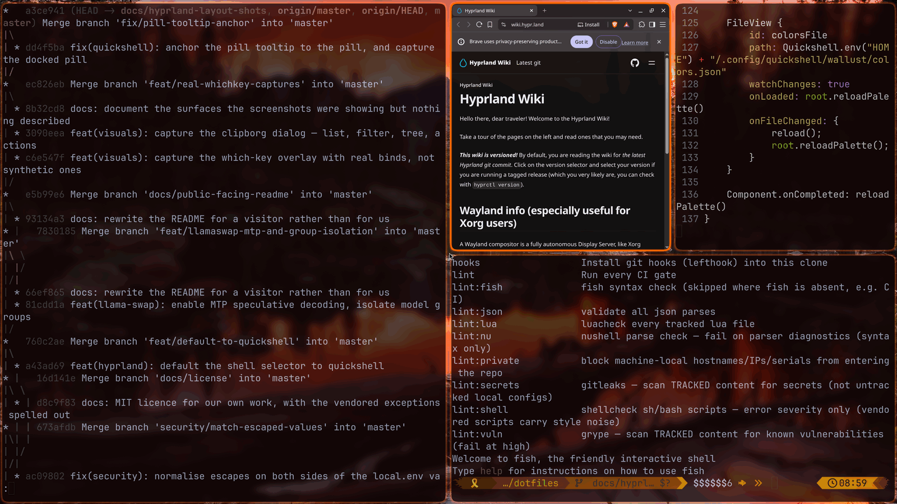
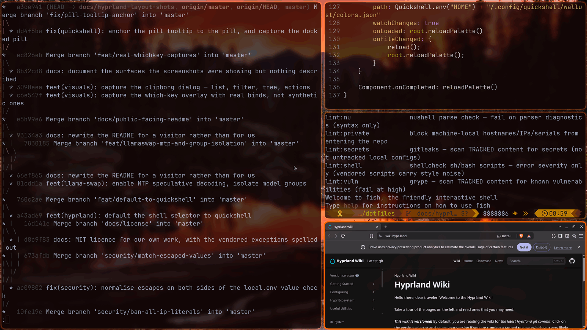
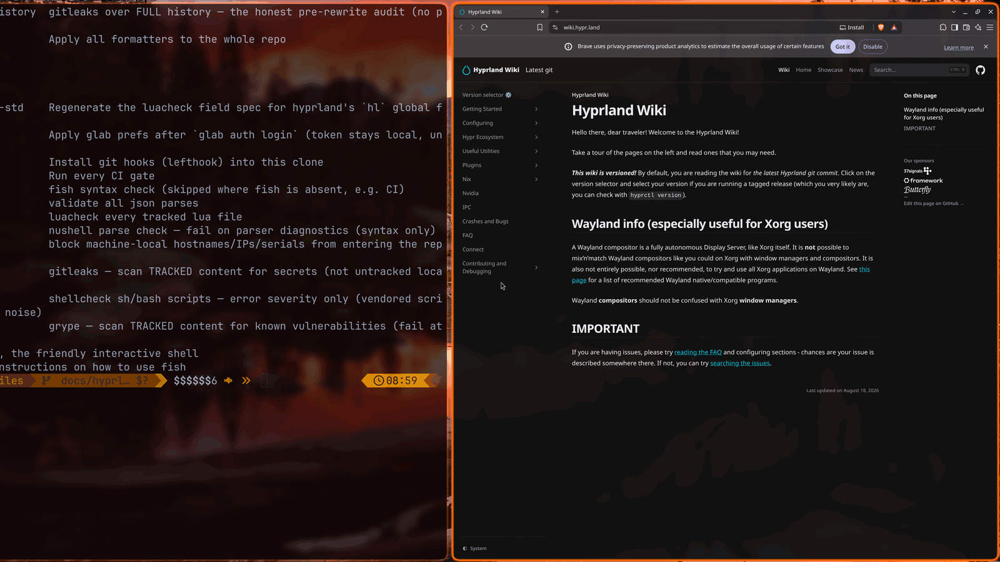

# dotfiles

Stow-managed dotfiles for Arch Linux (Hyprland) and macOS. One tree, one checkout,
every package documented.

The desktop is a [quickshell](https://quickshell.org/) shell — bar, launcher,
notification server and session overlay — replacing the waybar/rofi/swaync stack
it grew out of.


Every top-level directory is a stow package with its own README.

## Packages

### Shells and prompt

| Package | What |
|---------|------|
| [`fish`](fish/README.md) | primary interactive shell — and its three load-order traps |
| [`bash`](bash/README.md) | modular `~/.config/bashrc/` drop-ins |
| [`zsh`](zsh/README.md) | same loader shape, plus `~/.zfunc` completions |
| [`nushell`](nushell/README.md) | structured-data shell; four generated files |
| [`starship`](starship/README.md) | cross-shell prompt |
| [`atuin`](atuin/README.md) | shell history, sync, AI — the personal/work seam |

### Editors

| Package | What |
|---------|------|
| [`nvim`](nvim/README.md) | Neovim + lazy.nvim, plus vim/IdeaVim leftovers |
| [`helix`](helix/README.md) | secondary modal editor |
| [`flow`](flow/README.md) | Zig terminal editor, config kept as reference |
| [`dict`](dict/README.md) | harper-ls dictionary (editor-independent) |

### Git and code review

| Package | What |
|---------|------|
| [`git`](git/README.md) | the whole git config — profiles, hooks, credential helpers |
| [`gh`](gh/README.md) / [`glab-cli`](glab-cli/README.md) | forge CLIs; both write untracked auth files |
| [`gh-dash`](gh-dash/README.md) | GitHub PR/issue dashboard (a `gh` extension) |
| [`tuicr`](tuicr/README.md) | review TUI for local diffs and remote PRs/MRs |
| [`hunk`](hunk/README.md) | interactive diff review |
| [`lazygit`](lazygit/README.md) | git TUI |
| [`worktrunk`](worktrunk/README.md) / [`workmux`](workmux/README.md) | worktree managers, sharing one layout |

Stacked branches are managed by **git-spice**. The binary is `git-spice` — never
`gs` in a script or hook, because `/usr/bin/gs` is ghostscript. See `CLAUDE.md`.

### Desktop (Linux / Hyprland)

| Package | What |
|---------|------|
| [`hyprland`](hyprland/README.md) | the compositor config (Lua) |
| [`quickshell`](quickshell/README.md) | the desktop shell — bar, launcher, notifications, session **(screenshots)** |
| [`waybar`](waybar/README.md) | status bar, legacy |
| [`rofi`](rofi/README.md) | launcher, legacy |
| [`wallust`](wallust/README.md) | wallpaper-derived palettes — writes into six other packages |
| [`xdg`](xdg/README.md) | mime handlers and the terminal `xdg-open` uses |
| [`base`](base/README.md) | GTK2/Qt6/XSETTINGS theming, and a yarn supply-chain gate |
| [`kmonad`](kmonad/README.md) | keyboard remapping |
| [`brave-linux`](brave-linux/README.md) | Brave launch flags |

### Terminals and multiplexers

| Package | What |
|---------|------|
| [`ghostty`](ghostty/README.md) | the session terminal |
| [`tmux`](tmux/README.md) | multiplexer, popups, plugins |
| [`wezterm`](wezterm/README.md) | cross-platform fallback |
| [`zellij`](zellij/README.md) | alternate multiplexer |
| [`kitty`](kitty/README.md) | ⚠️ package layout is wrong — see its README |
| [`konsole`](konsole/README.md), [`yakuake`](yakuake/README.md), [`terminator`](terminator/README.md) | KDE/legacy |

### Tools

| Package | What |
|---------|------|
| [`commands`](commands/README.md) | personal scripts on `$PATH`, incl. `dotfiles-local-env` / `dotfiles-secrets` |
| [`metapac`](metapac/README.md) | declarative system packages across hosts |
| [`yazi`](yazi/README.md) | file manager |
| [`visidata`](visidata/README.md) | terminal data explorer |
| [`fastfetch`](fastfetch/README.md) | system info banner |
| [`grype`](grype/README.md) | vulnerability scanner defaults |
| [`bless`](bless/README.md) | hex editor |
| [`envman`](envman/README.md) | envman PATH file |

### Local AI and agents

| Package | What |
|---------|------|
| [`llama-swap`](llama-swap/README.md) | multi-model serving layer (replaced Lemonade) |
| [`ollama`](ollama/README.md) | model server, systemd user unit |
| [`clipborg`](clipborg/README.md) | clipboard manager with LLM actions |
| [`pi-agent`](pi-agent/README.md) | pi agent settings |
| [`docker`](docker/README.md) | MCP gateway |

### macOS

[`macos`](macos/README.md) — AeroSpace, Cocoa keybindings, and a one-shot bootstrap
script that is history rather than an installer.

### Not stow packages

[`mise-scripts/`](mise-scripts/README.md) — task scripts.
[`docs/`](docs/README.md) — images the READMEs embed.
[`server-hooks/`](server-hooks/README.md) — a GitLab `pre-receive` secret gate,
installed on the server, not on this machine.
`build/` — gitignored capture scratch.

## Usage

Packages mirror `$HOME`, so `fish/.config/fish/config.fish` installs to
`~/.config/fish/config.fish`.

Stow **one package at a time**, always with `--no-folding`:

```sh
stow --no-folding fish        # install
stow -D fish                  # remove
stow --no-folding -R fish     # reinstall, after adding/removing files
stow --no-folding -n -v fish  # dry run
```

### The folding hazard

Without `--no-folding`, stow links a whole **directory** when every file under it
belongs to one package. That is convenient right up until it isn't, and the flag
does not repair a package already deployed that way.

A folded file is dangerous because **the file at the target is not a symlink —
its parent is**. It looks like an ordinary file, `diff` against the repo shows no
difference (it *is* the repo's file), and deleting it deletes it **out of the
repo**. That is not hypothetical: it removed 20 tracked files here in one go,
following otherwise-sensible "move the real file aside and re-stow" advice.

The repair is `stow -R --no-folding -t ~ <pkg>`, never a deletion.

### Files a dotfiles repo should not own

A package should only contain files the repo writes end to end. Everything else
in a stowed directory gets one of three treatments:

| Tier | For | How |
|------|-----|-----|
| **excluded** | the tool writes it; nothing needs a starting point | `.stow-local-ignore` + `.gitignore` |
| **frozen seed** | the tool writes it, but something breaks if it is absent | tracked, stowed, `skip-worktree` |
| **repo-owned** | we write it, the tool only reads it | an ordinary tracked file |

Excluded is the default. The frozen case exists for files like the generated
Hyprland colour palette, where a bare `require` means absence is a config that
fails to load rather than a fallback to defaults.

⚠️ A package-local `.stow-local-ignore` **replaces** stow's built-in ignore list
rather than adding to it — so a package that has one must name `README.*` itself,
or the README ends up symlinked into `$HOME`.

## Trying it

```sh
git clone https://github.com/btilford/dotfiles.git ~/dotfiles
cd ~/dotfiles
stow --no-folding --dry-run -v fish   # look before you leap
```

Take packages individually. This is one person's setup, not a framework — the
Hyprland, quickshell and metapac packages in particular assume Arch and a
specific machine layout.

Some tooling is driven by [mise](https://mise.jdx.dev/):

```sh
mise run status          # classify every package: stowed, shadowed, folded, missing
mise run stow            # interactive package picker
mise run screenshots     # headless capture of the desktop surfaces
```

## Config that varies by machine

Nothing machine-specific is committed. Values come from a single untracked file,
`~/.config/dotfiles/local.env`, read by every shell through a drop-in, and by
anything launched outside a shell through `environment.d`:

```sh
mise run setup:local-env      # generate it, with placeholders
dotfiles-local-env --check    # report what is still missing
```

Each variable is declared in `commands/.local/share/dotfiles/required-env` along
with which file consumes it, so the audit cannot drift from the code.

A few configs need more than a value — a real identity, a session list, monitor
serials. Those live in a **separate private repo** that is never published, and
this one is deliberately incomplete without it: git has no catch-all identity
rule, so commits in unlisted directories fail rather than silently using the
wrong name. Where a file is needed to get started, an `.example` sibling ships
here.

## Screenshots

Every shell surface is generated, never taken by hand:

```sh
mise run screenshots -- --list
mise run screenshots -- --no-motion --scene drawer
```

A nested headless compositor runs the shell and each surface is driven over IPC,
so captures work over ssh with no display attached. See
[`mise-scripts/visuals/`](mise-scripts/visuals/README.md) — including its
isolation rules, which exist because getting this wrong once destroyed a running
desktop session.

### Tiling layouts

`SUPER + SHIFT + L` cycles the focused workspace between three layouts. Same four
windows in each shot — three terminals and a browser.

**dwindle** — each new window splits the one it lands on.



**master** — one main area on the left, the rest stacked beside it.



**scrolling** — windows are columns on a strip that scrolls sideways, so the ones
you are not using sit off-screen rather than shrinking. Column width is narrowed
for the shot; at this machine's `scrolling:column_width = 1.0` a single column
fills the output and the screenshot would be indistinguishable from a maximised
window.



These three are **live-session captures, not generated** — the only hand-taken
images here. Hyprland 0.56 (aquamarine) cannot start headless on this hardware,
and the harness above runs sway, whose layouts are not these. So they were taken
on a real session, on an empty workspace, with a throwaway browser profile and a
starship config with the hostname and username modules switched off.

## License

[MIT](LICENSE) for this repository's own work.

**Not everything here is covered by it.** Three bodies of vendored or derived
content keep their original licenses, and the MIT grant does not reach them:

| Content | License | Why it's here |
|---|---|---|
| 29 files derived from [JaKooLit/Hyprland-Dots](https://github.com/JaKooLit/Hyprland-Dots) — most of `hypr/scripts/`, the wallust config and templates, the rofi theme | **GPL-3.0** | the Hyprland setup started from that project |
| `yazi/.config/yazi/flavors/{ashen,sunset}.yazi/` | MIT | vendored so a fresh clone renders with no network |
| `git/.config/git/templates/hooks/*.sample` | GPL-2.0 | git's own samples, needed for a complete `init.templateDir` |

GPL-3.0 is copyleft: redistribute those files, modified or not, under GPL-3.0
with source available, and leave their attribution headers alone. Each vendored
yazi flavor carries its own `LICENSE` beside it.

Check a file's header before reusing it — that is the authoritative answer for
any individual file.
