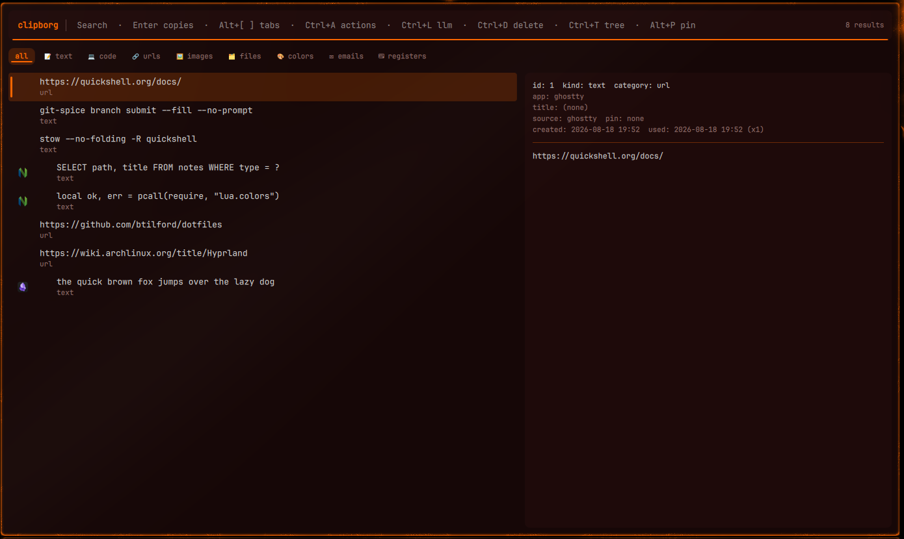
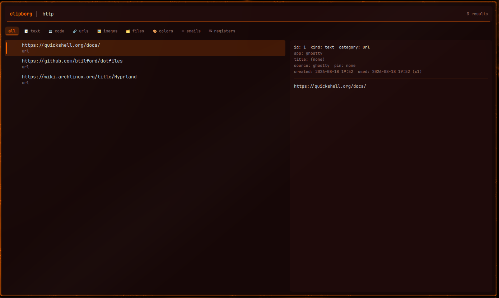
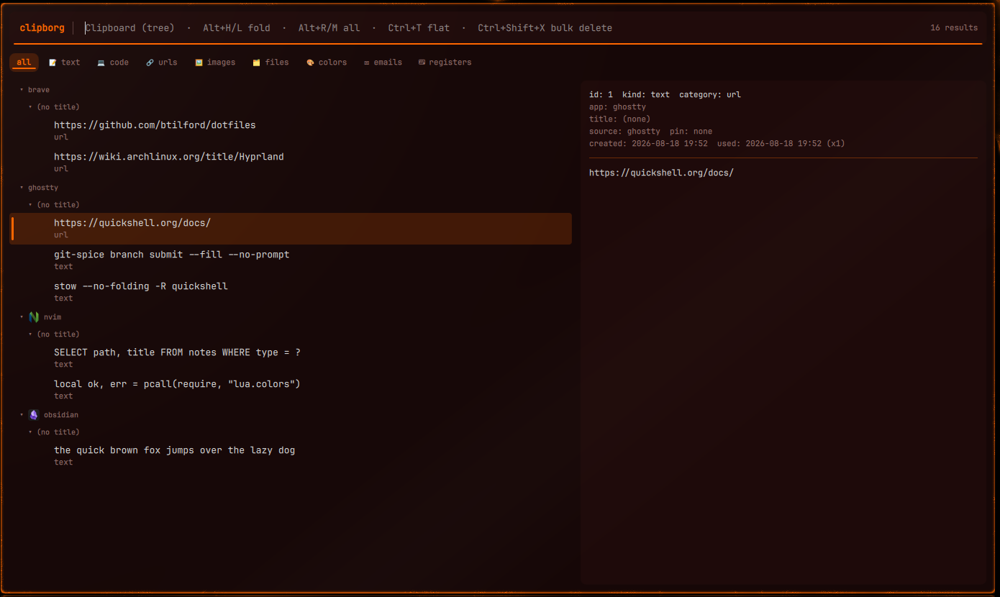
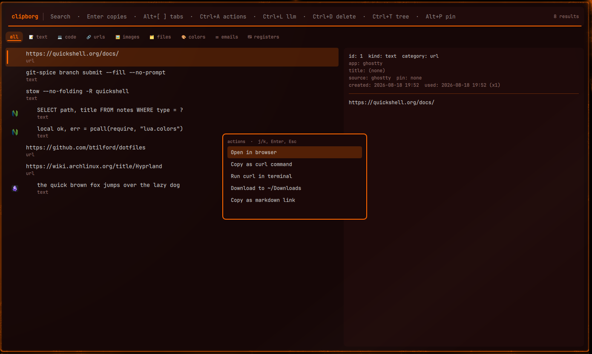

# clipborg — clipboard manager with LLM actions

Stow package. `stow --no-folding clipborg` from `~/dotfiles`.

| Path | Installs to |
|------|-------------|
| `.config/clipborg/config.toml` | `~/.config/clipborg/config.toml` |
| `.config/clipborg/prompts/*.md` | `~/.config/clipborg/prompts/` |
| `.config/systemd/user/clipborg.service.d/10-secrets.conf` | systemd drop-in |

Formerly **clipvault** — same project, renamed. Grep both spellings in old notes;
write new references as clipborg.

## The quickshell dialog

Bound to `SUPER+V`. `ClipboardDialog.qml` in the [`quickshell`](../quickshell/README.md)
package is a thin wrapper — the dialog itself ships with clipborg and arrives with
`git pull`. State lives in the `Clipboard` singleton and it is driven over IPC:

```sh
qs ipc call clipboard toggle
```



Entries are typed and tabbed — text, code, urls, images, files, colors, emails,
registers — with a preview pane showing the full content plus `kind`, `category`,
attributing app, source, pin state and use count.

Typing filters as you go:



`Ctrl+T` groups by attributing app, with the app's own icon resolved from its
desktop entry:



`Ctrl+A` opens the actions for the selected entry, and the list is **content-aware**
— a URL offers browser, curl, download and markdown-link, where a code block or a
file path would not:



`Ctrl+L` runs an LLM prompt against the entry (`prompts/*.md` below), `Ctrl+D`
deletes, `Alt+P` pins.

> **These screenshots are staged.** The entries are fabricated and the app
> attribution is stamped in by the capture rig. A real clipboard history is the
> most sensitive store on the machine — every password-manager copy, every token
> pasted between terminals — so the rig points `CLIPBORG_CONFIG` at a throwaway
> database under its own runtime dir and never opens the real one. Regenerate with
> `mise run screenshots -- --scene clipboard`.

## What this config turns on

Everything is spelled out rather than left to defaults, because disabling is
**subtractive, never an error** — config for a switched-off feature is ignored, not
rejected. That is what lets this committed base name things a given machine lacks
while `config.local.toml` switches them off.

| Feature | What it gives you |
|---|---|
| `registers` | vim/nvim register ingest — the `R` popup in the TUI, its own dialog tab |
| `pinning` | pin an entry forever, or until a duration you type |
| `actions` | the `Ctrl+A` menu, from `[[actions]]` |
| `filters` | the blocklists below |
| `llm.*` | prompts against an entry: subprocess harnesses, HTTPS providers, a tmux mode, foreground mode, edit-before-send, and a per-run backend picker |

Retention is capped per kind — 5000 text entries, 10 images, 10 files — with a
5-second dedup window, and `max_text_bytes` at 1 MiB.

## Two filters that matter

**Password managers are always skipped**, regardless of config: a clipboard offer
tagged `x-kde-passwordManagerHint` (KeePassXC and friends) is never recorded.

**Forge tokens are blocked by regex**, because copying a PAT out of a GitLab or
GitHub page is routine and clipborg's store is sqlite on real disk with retention
measured in weeks. Without this a token outlives the five seconds it was meant to
exist for, gets backed up, and is one `clipborg list` away from a terminal.
Blocking affects only the *recording* — the copy itself works normally. The
patterns cover GitLab's nine `gl*-` token prefixes, GitHub classic `gh[pousr]_`,
and fine-grained `github_pat_`.

⚠️ **`content_regex` in `config.local.toml` REPLACES this array, it does not extend
it.** Tables merge key by key, but every array outside `[[actions]]` and
`[[llm.*]]` replaces wholesale. A machine whose local file sets `content_regex`
for any unrelated reason silently loses the token patterns — verified the hard way
on 2026-08-03, when a copied `glpat-` string was recorded because the local file
had a different blocklist. Restate them there, or drop the local key.

Prefixes are matched rather than exact lengths: GitLab has widened `glpat-` twice,
and a rule that misses a longer token is worse than one that occasionally blocks a
string merely shaped like a token. A false positive costs one unrecorded clipboard
entry.

## Two-layer config

This file is the **base** layer. clipborg reads
`~/.config/clipborg/config.local.toml` on top of it — a real file, never stowed
and never committed, and the only place API keys and per-machine paths belong.

The local layer **merges** rather than replaces: tables merge key by key, and
`[[actions]]` / `[[llm.prompts]]` / `[[llm.harnesses]]` merge **by `id`**, so a
local file can change one prompt's harness without restating the whole array.
Every other array replaces wholesale.

Strings may use `${VAR}`, expanded from the environment at load (`$${` is a
literal `${`). **An unset variable is a hard error at startup**, not an empty
string — which is exactly why secrets reach the shell environment on this machine
at all (see "Secrets reach the shell from a tmpfs cache" in the root `CLAUDE.md`).

## `10-secrets.conf`

A systemd drop-in pointing the unit at the session secret cache:

```ini
EnvironmentFile=-%t/dotfiles/secrets.env
```

The leading `-` keeps the unit startable on a machine with no secrets at all.
`dotfiles-secrets.service` writes that file once at login into `$XDG_RUNTIME_DIR`
(tmpfs, 0700/0600, gone at logout).

Enable by hand-linking `.wants` — never `systemctl --user enable` a stowed unit,
which deletes the symlink on `disable`/`reenable`.

## Prompts and colours

`prompts/*.md` are the LLM action bodies (summarize, explain-code, research-url,
implement-plan, vault-ingest, …), referenced by `id` from `config.toml`.

`~/.config/clipborg/colors.json` is written by [`wallust`](../wallust) on every
wallpaper switch — generated, not tracked.

The quickshell clipboard dialog fetches clipborg's capabilities over IPC; it never
reads this file.
