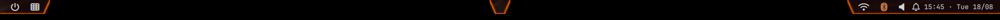
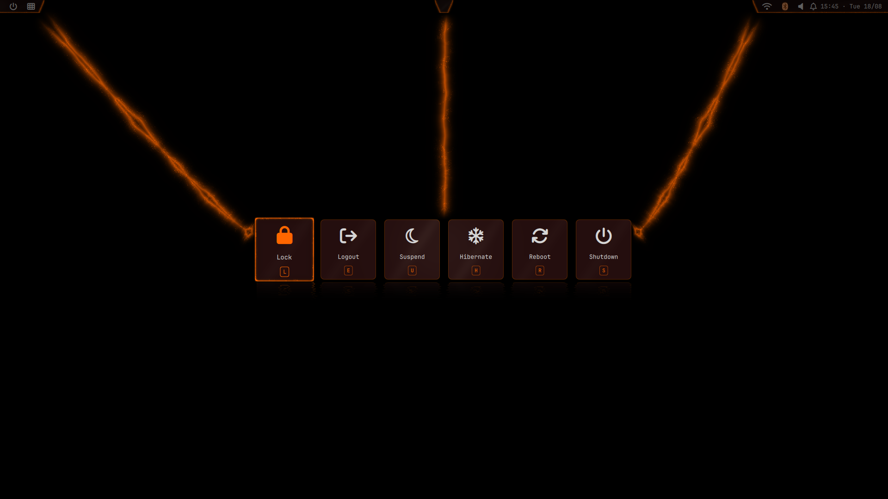
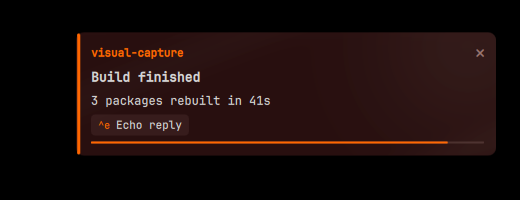
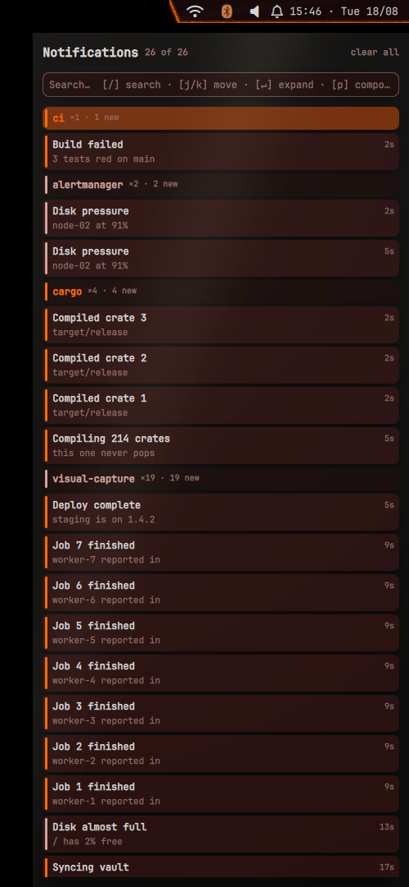
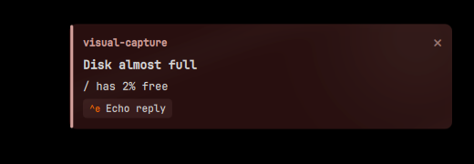
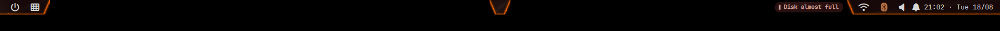
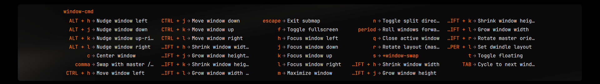
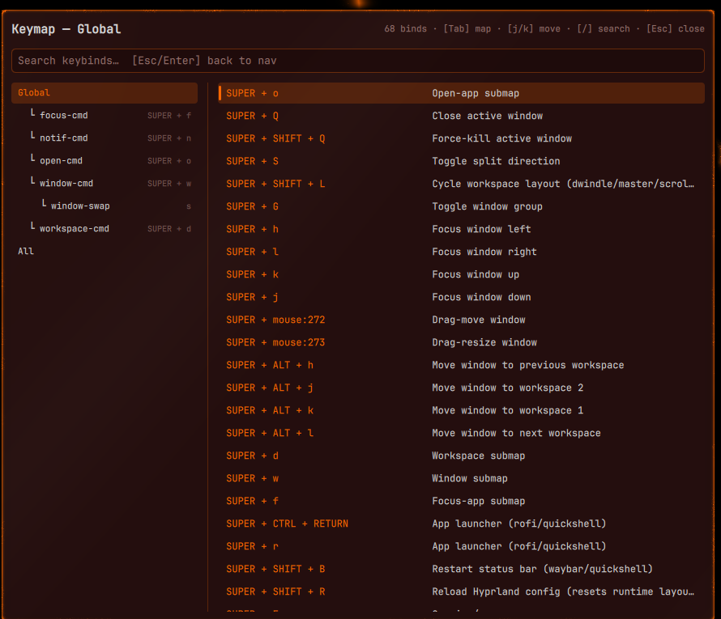
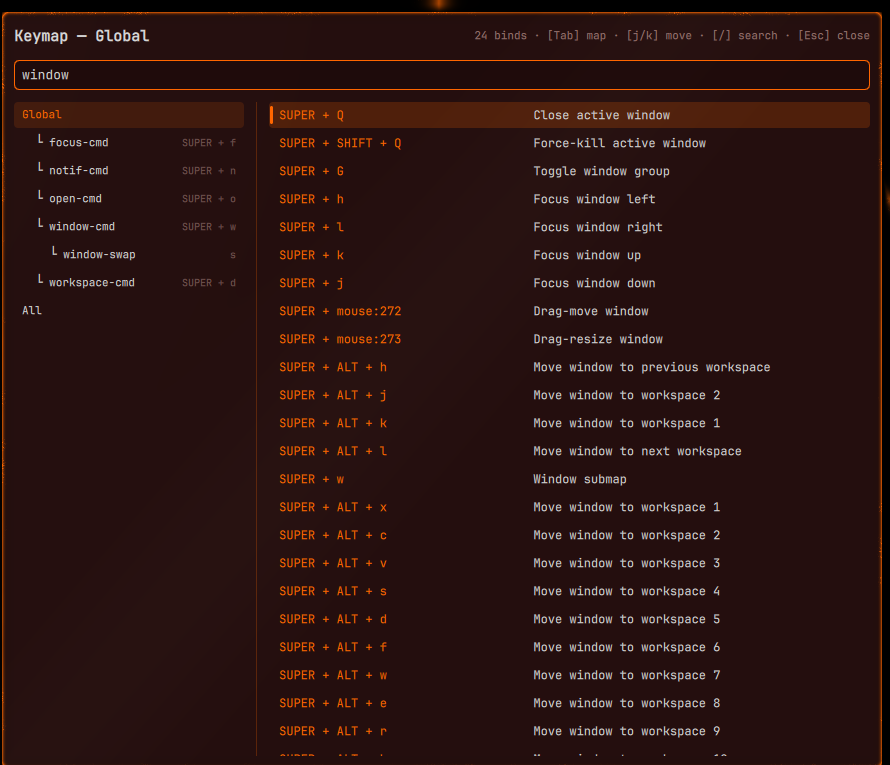

# quickshell — the desktop shell

Stow package. `stow --no-folding quickshell` from `~/dotfiles`.

A DIY [quickshell](https://quickshell.org/) desktop, built incrementally to
replace the waybar/rofi/swaync stack. One persistent `qs` process hosts every
surface. Targets **stable quickshell 0.3.0** (Arch repo), *not* `quickshell-git`.

Installs to `~/.config/quickshell/` — the default config path, so bare `qs` and
`qs ipc` target it with no `-c` flag.

> Deep design notes, IPC contracts and the per-component rules live in
> [`CLAUDE.md`](CLAUDE.md). This file is the tour.

## Bar

Always on screen. Power and workspace glyphs at the left, status at the right.



## Launcher

Replaces rofi. Modes: **combi** (default — apps plus a `run:` fallback), **drun**,
**run** (`$PATH` autocomplete via `compgen -c`), **files**, **emoji**, **glyphs**,
**icons**, **wallpaper**. `Tab` cycles; prefixes jump straight to one (`>` run,
`/` or `~` files, `:` emoji, `;` glyphs, `#` icons, `!` wallpaper).


```sh
qs ipc call launcher toggle [mode]
```

Placed on `Hyprland.focusedMonitor`.

## Session overlay

Lock / logout / suspend / hibernate / reboot / shutdown, each with a single-key
accelerator.



```sh
qs ipc call session show
```

## Notifications

A full `org.freedesktop.Notifications` server — popups with actions and a
remaining-time bar, plus a searchable history drawer.

| Popup | History drawer |
|-------|----------------|
|  |  |

A sticky notification has no remaining-time bar and does not expire — critical
urgency, or a rule that says so. It stays until dismissed, and can fold to a pill
docked in the bar rather than holding a full card on screen:



After `criticalCollapseMs` a sticky card folds to a **pill and docks in the bar**,
in the gap between the workspaces and the status cluster — keeping the notification
available without holding a full card on screen:



Click the pill to bring the card back (with a fresh collapse clock), middle-click to
dismiss. Past `maxPills` the tray collapses further to a single `+N` chip that opens
the drawer, because the bar is not a queue.

The drawer groups by app, supports `/` search and `j`/`k` navigation, and the
popup stack has its own keyboard-focus mode. Placement is a preset
(right-center / bottom-center), and routing/sticky/silence decisions come from a
Lua rules file. Per-machine config is `~/.config/quickshell/notifications.json` —
**untracked**; provision from `notifications.example.json`.

⚠️ **The `actions` capability is not optional.** A notification server that does
not advertise it loses every Chromium client silently — no error, no retry. They
fall back to internal notification windows, which Hyprland then tiles fullscreen.

## Which-key submap hints

An on-screen legend for the active Hyprland submap, driven from the compositor's
submap state and the real bind list (`hyprctl binds -j`), so the labels are the
`description` fields from `keybindings.lua` rather than a second copy to keep in
sync. A bind that enters a nested submap renders as a which-key `+group` marker
rather than by its dispatcher — `s → +window-swap` below.



The layout is width-driven, so a sparse map is a single short row:


## Keymap cheatsheet

The full keybinding reference, as distinct from the transient which-key strip
above. `qs ipc call keymap toggle`.



The sidebar is a **tree of submaps**, nested under the map whose entry bind lives
there — `window-swap` sits inside `window-cmd` — with `Global` at the root and
`All` at the bottom. Each node shows the chord that enters it, so the sidebar
doubles as the answer to "how do I get into this map".

Navigation is vim-modal. It opens in NAV mode: `j`/`k` move, `Ctrl-d`/`Ctrl-u`
half-page, `gg`/`G` jump, `Tab`/`Shift-Tab` cycle tree nodes. `/` or `i` focuses
the search box, which filters live across chords and descriptions; `Esc` or
`Enter` returns to NAV.



Both this and the which-key strip read `hyprctl binds -j`, so the descriptions are
the `description` fields from `keybindings.lua` — there is no second list to keep
in sync.

## Clipboard

`SUPER+V` opens the clipborg history dialog — search, type tabs, a preview pane,
grouping by app, and content-aware actions.

The dialog is **not defined here**. `components/ClipboardDialog.qml` is a thin
wrapper over the one the clipborg repo ships (`examples/quickshell/Clipborg`, on
`QML_IMPORT_PATH`); this package supplies only where it shows, what drives it, and
the theme. Fix dialog *behaviour* upstream, not here.

It loads through a `LazyLoader` on purpose: on a machine with no clipborg clone the
`import Clipborg` fails, and the LazyLoader keeps that failure from taking the rest
of the shell down with it.

**Screenshots and the feature tour live in [`clipborg/`](../clipborg/README.md)** —
the features are clipborg's, so they are documented with the tool rather than with
its host.

## Connector lines

Energy lines drawn between the bar and its popouts: one fullscreen transparent
window per screen, mapped only while that screen has live links. Input-invisible —
empty mask, so full click and hover passthrough, no keyboard focus, no exclusion
zone — and on the Top layer rather than Overlay so it can never stack above the
launcher or a dialog.

Pure flourish, with no static fallback: with effects off, the lines are simply
absent.

## Shaders

Nine GLSL fragment shaders, compiled to `.qsb` and committed alongside their
sources, do the visual work that a static stylesheet cannot:

| Shader | Does |
|---|---|
| `energyfill` | flowing plasma fill for active-item highlights — the workspace pill, the active-window indicator — instead of a flat accent rectangle |
| `energyborder` / `energyline` / `energycurve` | electric arcs: around a surface, along a rotated quad, and along a curve. The centerline wobbles with fbm noise |
| `energyglyph` / `neonglyph` | the same treatment applied to glyphs |
| `neonfill` | the neon variant of the fill |
| `shimmer` | a soft warm highlight that **leans toward the cursor** — a light-position effect, not pointer tracking |
| `reflection` | water-mirror reflection: samples the source flipped, offset by ripple waves that grow with depth and fade out |

They are what makes the bar and the connector lines read as one lit surface rather
than a set of rectangles.

All of it is gated:

```sh
QS_EFFECTS=full   # everything
QS_EFFECTS=low    # reduced
QS_EFFECTS=off    # every shader swapped for a static equivalent
```

`off` is the one to reach for on a machine where the GPU is busy or the shell is
being debugged — the layout is identical, so nothing moves, it just stops glowing.
The connector lines are the exception: they are pure flourish with no static
fallback, so they are simply absent.

Recompile a shader after editing the `.frag`, or the committed `.qsb` — which is
what the shell actually loads — silently keeps rendering the old version.

## Screenshots

Every image above came from the headless harness — no physical display, no
logged-in graphical session:

```sh
mise run screenshots -- --no-motion          # stills, every surface
mise run screenshots -- --list               # what the scenes are
mise run screenshots -- --scene drawer       # one surface
```

`build/visuals/` is gitignored scratch; the long-term history lives in the notes
vault. `docs/images/` holds only the handful of stills this README embeds. See
[`mise-scripts/visuals/README.md`](../mise-scripts/visuals/README.md) — **including
its isolation section**: an agent-launched compositor destroyed the live desktop
session on this machine once, and the rules that came out of that are not
negotiable.

## Working on it

**quickshell does not hot-reload through stow.** `qs` keeps running the QML it
already parsed, so a repo edit changes nothing until the daemon restarts. Test a
branch without touching the live shell:

```sh
qs -p ~/dotfiles/quickshell/.config/quickshell/shell.qml
```

Two more traps worth knowing before debugging QML here:

- **`DesktopEntries` scans lazily.** Nothing is populated until something *binds*
  to `.applications`; an imperative `heuristicLookup()` at startup returns null
  forever. Resolve icons from the entry's `Icon=`, not from `app_id`.
- **A `property data` on an `Item` shadows `Item.data`,** so the layer surface
  never keyboard-activates — mouse works, keyboard is dead, and nothing logs.

`wallust/colors.json` is written on every wallpaper switch and is excluded in both
`.stow-local-ignore` and `.gitignore`.
